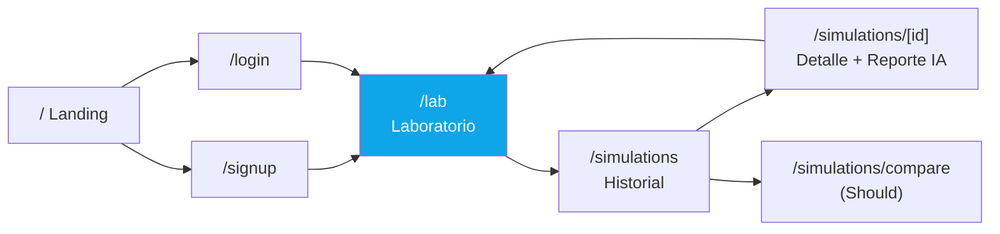
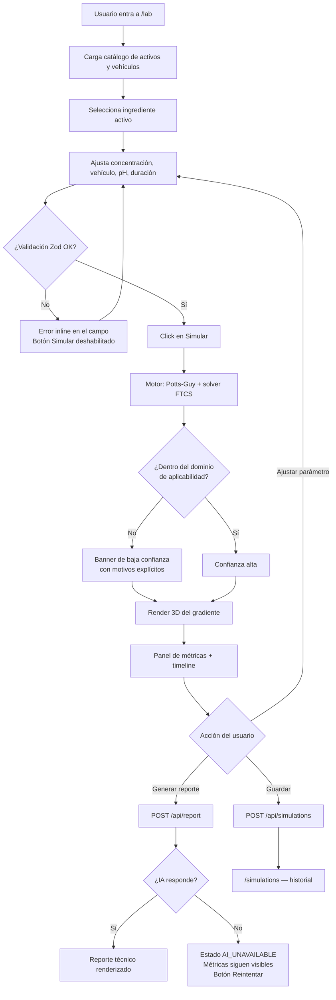
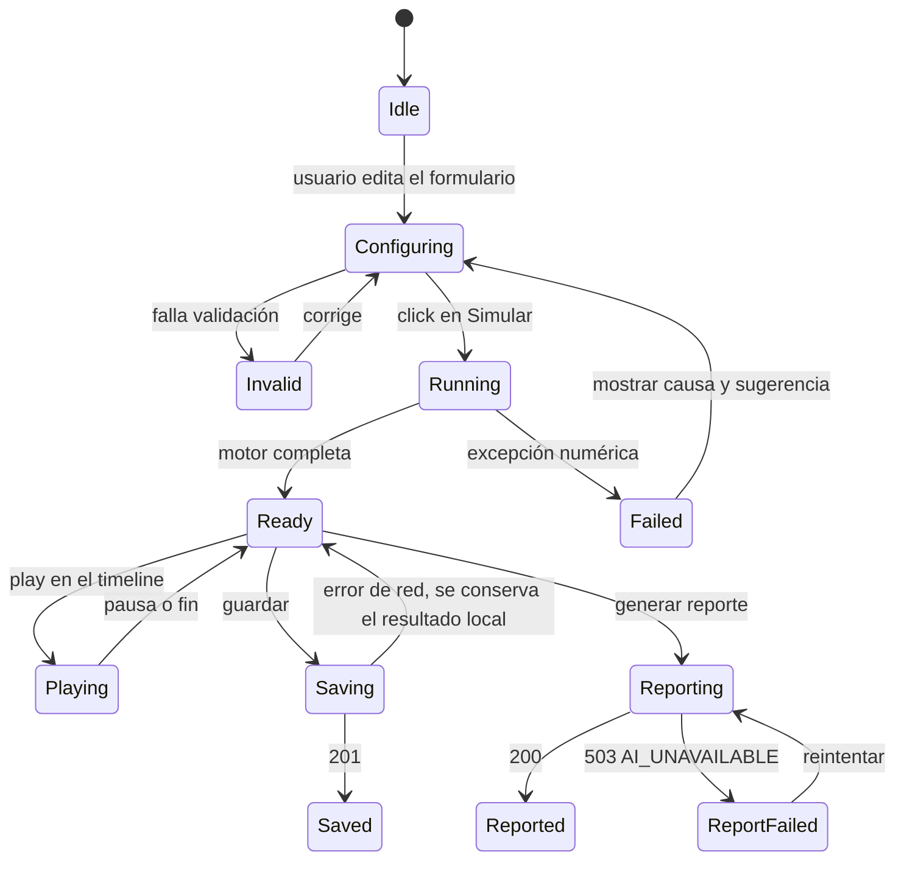
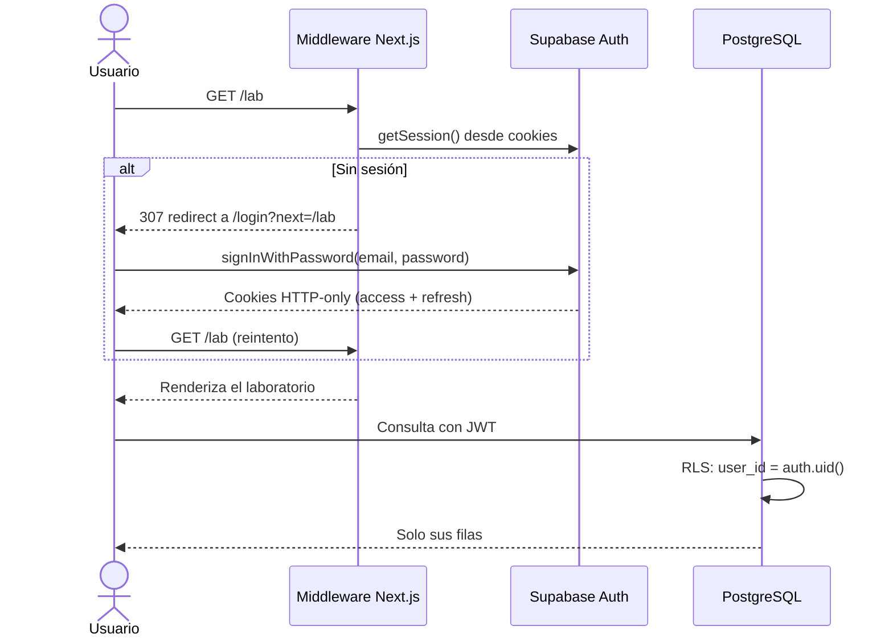

# Flujo de la Aplicación — DERMASENSE

---

## 1. Mapa de navegación

Rutas bajo `(app)` protegidas por middleware: sin sesión válida redirigen a `/login?next=`.

---

## 2. Flujo principal — "de la hipótesis al insight"

**Principio de diseño del flujo:** el bucle `D → G → M → D` (ajustar, simular, leer, ajustar)
debe cerrarse en menos de 5 segundos. Es el corazón del producto: si iterar es rápido, el
formulador explora; si es lento, vuelve a su hoja de cálculo.

---

## 3. Estados de la simulación

**Invariante crítica:** una vez alcanzado `Ready`, ningún fallo posterior (red, IA, guardado)
puede destruir el resultado en pantalla. El valor central del producto ya fue entregado.

---

## 4. Flujo de autenticación

Al primer registro, un trigger de PostgreSQL crea automáticamente la fila en `profiles`.

---

## 5. Estados vacíos y de error (UX)

| Situación | Qué ve el usuario | Salida |
|---|---|---|
| Historial vacío | Ilustración + "Aún no has simulado nada" | CTA a `/lab` |
| Fuera de dominio del modelo | Banner ámbar con los motivos (ej. "MW 780 > 500 Da") | Sigue viendo resultados, marcados de baja confianza |
| Motor falla numéricamente | Mensaje con el parámetro sospechoso | Botón "Restaurar valores por defecto" |
| IA no disponible | Tarjeta de reporte en estado de error | "Reintentar"; métricas intactas |
| Sin conexión al guardar | Toast "No se pudo guardar, se conserva localmente" | Reintento manual |
| Navegador sin WebGL | Fallback a corte 2D en canvas | Toda la información numérica sigue disponible |

---

## 6. Recorrido de demo para el pitch (2 minutos)

1. **Landing** — la promesa en una frase.
2. **Laboratorio** — se carga con retinol 0.3 % preconfigurado.
3. **Simular** — el gradiente atraviesa el estrato córneo en vivo; se lee el *lag time*.
4. **Cambiar el vehículo** a etanólico — el flujo sube visiblemente; el índice de irritación
   también. Ese contraste es el momento que demuestra el valor.
5. **Reporte IA** — interpretación técnica con supuestos y limitaciones explícitas.
6. **Panel de supuestos** — se muestra deliberadamente lo que el modelo NO afirma.

El paso 6 no es una concesión: es el diferenciador frente a herramientas que venden certeza
que no tienen.
