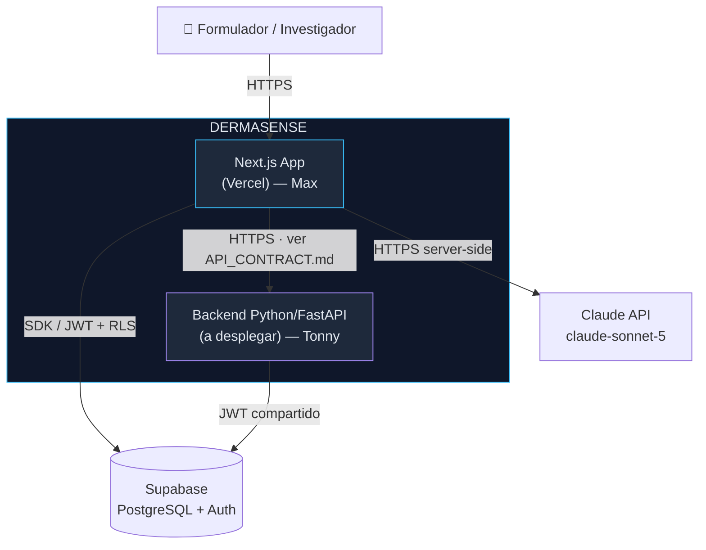
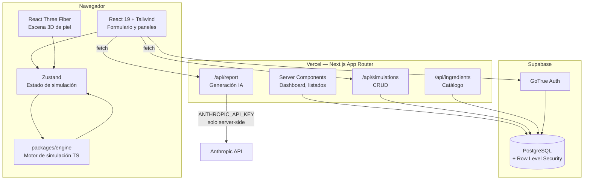
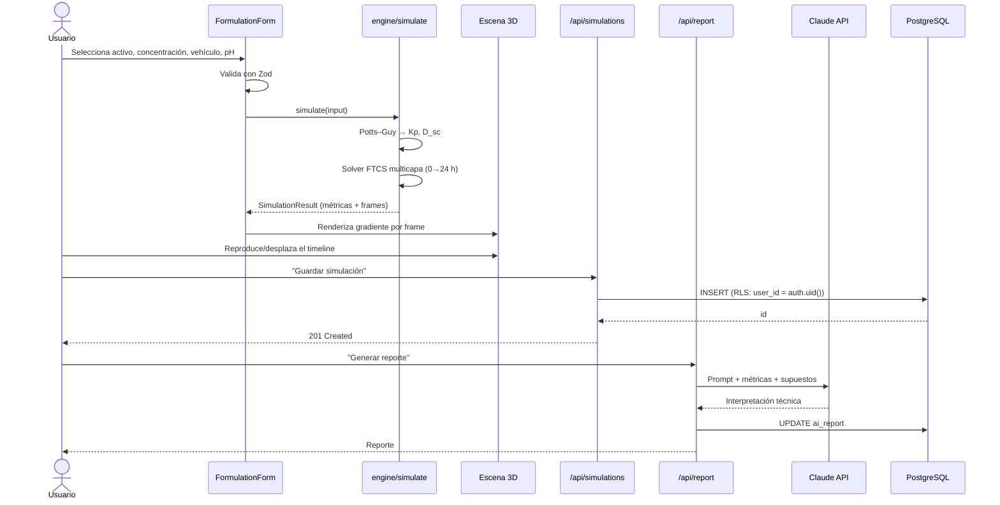
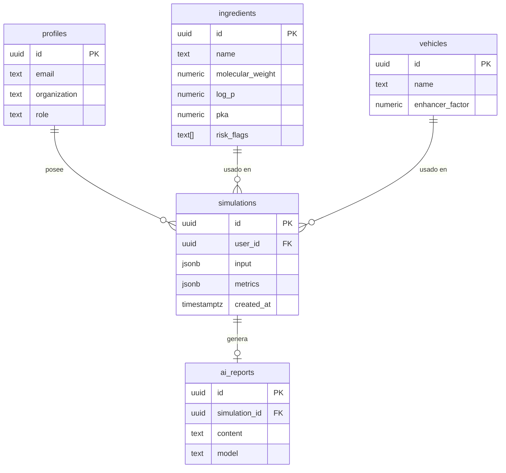
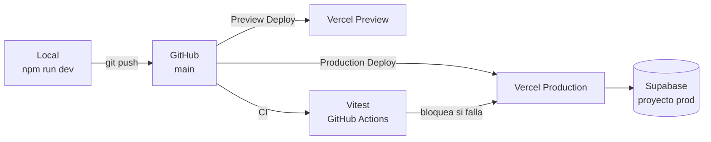

# Arquitectura — DERMASENSE

## 1. Vista de contexto (C4 nivel 1)



**Decisión clave (ADR-001, reafirmada en [ADR-004](adr/004-arquitectura-hibrida-ts-python.md)):**
el motor de simulación corre **en el navegador**, no en ningún servidor. Es TypeScript puro
y determinista, así que no hay latencia de red, la interacción con el timeline es
instantánea y el costo de infraestructura es cero.

**Arquitectura híbrida de dos backends**, con reparto de trabajo del equipo:

| Backend | Dueño | Responsabilidad | NO hace |
|---|---|---|---|
| Next.js Route Handlers (Vercel) | Max | Persistencia de simulaciones, reporte con Claude, catálogo | No simula, no hace ML |
| FastAPI (Python) | Tonny | Investigación de ingredientes (RAG), predicción ML/QSPR, reportes Excel, revisión regulatoria | No recalcula la difusión — la recibe ya calculada |

El contrato exacto entre el frontend y el backend Python está en
[API_CONTRACT.md](API_CONTRACT.md), para que ambos lados avancen en paralelo sin
bloquearse.

---

## 2. Vista de contenedores (C4 nivel 2)



---

## 3. Estructura de módulos

```
dermasense/
├── app/
│   ├── (marketing)/page.tsx           # Landing + propuesta de valor
│   ├── (auth)/login/ · signup/
│   ├── (app)/
│   │   ├── lab/page.tsx               # Laboratorio: config + 3D + métricas
│   │   ├── simulations/page.tsx       # Historial del usuario
│   │   └── simulations/[id]/page.tsx  # Detalle + reporte IA
│   └── api/
│       ├── ingredients/route.ts
│       ├── simulations/route.ts       # GET lista · POST crear
│       ├── simulations/[id]/route.ts  # GET · DELETE
│       └── report/route.ts            # POST → Claude
├── packages/engine/                   # ⚠ SIN dependencias de React ni red
│   ├── constants.ts                   # Capas, D, k por defecto
│   ├── qspr.ts                        # Potts–Guy, partición, dominio
│   ├── diffusion.ts                   # Solver FTCS multicapa
│   ├── metrics.ts                     # Métricas derivadas
│   ├── irritation.ts                  # Índice heurístico
│   ├── simulate.ts                    # Orquestador → SimulationResult
│   └── types.ts
├── components/
│   ├── skin3d/                        # SkinScene, LayerMesh, ConcentrationField
│   ├── lab/                           # FormulationForm, MetricsPanel, Timeline
│   └── ui/                            # shadcn/ui
├── lib/
│   ├── supabase/{client,server}.ts
│   ├── anthropic.ts
│   └── validation.ts                  # Esquemas Zod compartidos
├── tests/
│   ├── engine/                        # Unitarias del motor
│   └── api/                           # Integración de Route Handlers
└── docs/
```

**Regla de dependencias:** `packages/engine` no importa nada de `app/`, `components/` ni
`lib/`. Esto lo hace testeable de forma aislada y reutilizable en un futuro worker o backend.

---

## 4. Flujo de una simulación



---

## 5. Modelo de datos (resumen)



Detalle completo, índices y políticas RLS en [BACKEND_SCHEMA.md](BACKEND_SCHEMA.md).

---

## 6. Despliegue



- Cada push a `main` dispara build + tests + deploy con timestamp verificable.
- Secretos gestionados como *Environment Variables* de Vercel; nunca en el repositorio.
- Variables con prefijo `NEXT_PUBLIC_` son públicas por diseño; `ANTHROPIC_API_KEY` y
  `SUPABASE_SERVICE_ROLE_KEY` **jamás** llevan ese prefijo.

---

## 7. Decisiones arquitectónicas

| ADR | Decisión |
|---|---|
| [ADR-001](adr/001-motor-de-simulacion-en-el-cliente.md) | Motor de simulación en el cliente |
| [ADR-002](adr/002-modelo-potts-guy.md) | Potts–Guy como base del modelo predictivo |
| [ADR-003](adr/003-supabase-rls.md) | Supabase con RLS para aislamiento multi-tenant |
