# Plan de Implementación — DERMASENSE

**Contexto:** hackathon de 7 h. Fase 1 cierra a las **12:00 p.m.**, Fase 2 a las **4:00 p.m.**

---

## 0. Evaluación honesta del alcance

Antes del plan, la verdad sobre qué cabe y qué no:

**Cabe con holgura:** motor de simulación (Potts-Guy + FTCS), visor 3D de 4 capas con
gradiente animado, panel de métricas, auth de Supabase, persistencia con RLS, reporte con
Claude, suite de pruebas, deploy en Vercel.

**Cabe con riesgo:** comparación lado a lado (US-10) y exportación a PDF (US-11). Son
*Should*, no *Must*. Si a las 14:30 el flujo principal no está desplegado y verde, se
descartan sin discusión.

**No cabe y no debe intentarse:** multi-activo, colaboración en tiempo real, calibración
experimental, animaciones sofisticadas de moléculas individuales. Intentarlo es la forma
más común de llegar a las 16:00 sin nada desplegado.

**El riesgo número uno no es técnico, es de secuencia:** dejar el deploy para el final.
Contramedida: se despliega un "hola mundo" a Vercel **antes de las 11:00**, con el pipeline
funcionando. A partir de ahí cada push es un deploy incremental y el timestamp de entrega
está garantizado.

---

## FASE 1 — hasta las 12:00 (Arquitectura, setup y código base)

### Bloque 1.1 · Documentación y repositorio (≈ 45 min)

- [x] Estructura `/docs` y documentos: PRD, TRD, Arquitectura, Flujo, UI/UX, Backend,
      Modelo de simulación, este plan.
- [x] README inicial con misión, problema, MVP, stack, setup e integrantes.
- [ ] Completar nombres, usuarios de GitHub y roles reales en el README.
- [ ] `.gitignore`, `.env.example`, `LICENSE`.
- [ ] Crear repo en GitHub, primer push, **Release `Arquitectura - DERMASENSE`**.

> El release de Fase 1 puede publicarse en cuanto la documentación esté completa. No hay
> razón para esperar a las 11:59.

### Bloque 1.2 · Scaffold del proyecto (≈ 30 min)

```bash
npx create-next-app@latest . --typescript --tailwind --app --eslint --src-dir=false
npm i three @react-three/fiber @react-three/drei zustand zod \
      @supabase/supabase-js @supabase/ssr @anthropic-ai/sdk
npm i -D vitest @vitejs/plugin-react jsdom @testing-library/react
npx shadcn@latest init
```

- Configurar `vitest.config.ts` y los scripts `test`, `test:watch`, `test:coverage`.
- **Deploy inicial a Vercel** con las variables de entorno cargadas. Verificar que la URL
  de producción responde. *Este paso no se pospone.*

### Bloque 1.3 · Motor de simulación (≈ 60 min) — **ruta crítica**

Orden estricto, cada archivo con su test antes de pasar al siguiente:

1. `packages/engine/types.ts` — contratos del TRD.
2. `packages/engine/constants.ts` — capas por defecto, difusividades, tasas de eliminación.
3. `packages/engine/qspr.ts` — Potts-Guy, partición SC/vehículo, chequeo de dominio.
   → `tests/engine/qspr.test.ts`
4. `packages/engine/diffusion.ts` — malla no uniforme, solver FTCS con paso CFL.
   → `tests/engine/diffusion.test.ts` (balance de masa, sin `NaN`, sin negativos)
5. `packages/engine/metrics.ts` + `irritation.ts`.
6. `packages/engine/simulate.ts` — orquestador.
   → `tests/engine/simulate.test.ts` (happy path)

**Criterio de salida del bloque:** `npm test` en verde y una simulación de ácido salicílico
2 % produciendo métricas físicamente razonables. Sin esto, nada más importa.

### Bloque 1.4 · Base de datos (≈ 25 min, en paralelo)

- Proyecto Supabase, ejecutar `001_init` → `004_seed`.
- Verificar RLS con dos usuarios de prueba: el usuario B no puede leer filas del usuario A.
- Clientes `lib/supabase/{client,server}.ts` y middleware de sesión.

### Bloque 1.5 · Shell de UI (≈ 20 min)

- Layout de tres columnas de `/lab` con datos simulados (*mock*).
- Tokens de color y tipografía del design brief en `globals.css`.

**Entregable de Fase 1:** Release `Arquitectura - DERMASENSE` con documentación completa,
motor probado, base de datos operativa y deploy vivo.

---

## FASE 2 — hasta las 16:00 (Core, IA, pruebas y despliegue final)

### Bloque 2.1 · Visor 3D (≈ 60 min) — **el mayor riesgo técnico**

1. `SkinScene`: bloque en corte con cuatro capas de espesor proporcional.
2. Conmutador de escala lineal / logarítmica (sin él, el estrato córneo es invisible).
3. Textura de datos 1D alimentada por `frames[t]`; actualización por `useFrame` sin
   re-render de React.
4. Etiquetas de capa, leyenda de concentración, órbita limitada.

**Time-box duro: 75 min.** Si a los 75 minutos no hay gradiente animado, se conmuta al
fallback de corte 2D en canvas (una hora de trabajo menos, transmite el 80 % del mensaje) y
se sigue adelante. Un 3D a medias que no compila es peor que un 2D que funciona.

### Bloque 2.2 · Formulario y métricas (≈ 45 min)

- `FormulationForm` con validación Zod y errores inline.
- Store de Zustand y máquina de estados de [APP_FLOW](APP_FLOW.md) §3.
- `MetricsPanel`, `IrritationGauge`, `ConfidenceBanner`, `Timeline`.

### Bloque 2.3 · Persistencia y auth (≈ 35 min)

- Páginas de login y registro.
- `POST/GET /api/simulations`, `GET/DELETE /api/simulations/[id]`.
- Página de historial `/simulations`.

### Bloque 2.4 · Reporte con IA (≈ 30 min)

- `POST /api/report` con el prompt de [AI_PROMPTS](AI_PROMPTS.md).
- Estados de carga, error y reintento en la UI.
- Persistencia en `ai_reports`.

### Bloque 2.5 · Pruebas obligatorias (≈ 25 min)

- `tests/api/simulations.test.ts`: 201 válido · 400 inválido · 401 sin sesión.
- `tests/api/report.test.ts`: **error crítico** — proveedor de IA caído produce
  `AI_UNAVAILABLE` sin romper la aplicación.
- `tests/engine/domain.test.ts`: ácido hialurónico (MW 5000) marca `confidence: 'low'`.

### Bloque 2.6 · Pulido, deploy final y pitch (≈ 40 min)

- Landing con la propuesta de valor.
- Panel de supuestos y limitaciones enlazado desde cada resultado.
- Revisión de seguridad: `git grep -iE "sk-ant|service_role|eyJ"` debe salir vacío.
- Deploy final verificado en producción **antes de las 15:40**.
- `docs/pitch.pdf` y Release `Entrega Final - DERMASENSE`.

---

## Cronograma

```mermaid
gantt
    title DERMASENSE — Hackathon
    dateFormat HH:mm
    axisFormat %H:%M

    section Fase 1
    Documentación y repo      :done, d1, 09:20, 45m
    Scaffold + deploy inicial :active, d2, 10:05, 30m
    Motor de simulación       :crit, d3, 10:35, 60m
    Base de datos             :d4, 10:35, 25m
    Shell de UI               :d5, 11:35, 20m
    RELEASE Fase 1            :milestone, m1, 12:00, 0m

    section Fase 2
    Visor 3D                  :crit, e1, 12:00, 75m
    Formulario y métricas     :e2, 13:15, 45m
    Persistencia y auth       :e3, 14:00, 35m
    Reporte con IA            :e4, 14:35, 30m
    Pruebas obligatorias      :e5, 15:05, 25m
    Pulido y deploy final     :e6, 15:20, 40m
    RELEASE Final             :milestone, m2, 16:00, 0m
```



---

## Puertas de decisión (go / no-go)

| Hora | Debe estar listo | Si no lo está |
|---|---|---|
| 11:00 | Deploy vivo en Vercel | Detener todo y resolverlo. Es bloqueante para la entrega |
| 12:00 | Motor probado y release de Fase 1 | Publicar el release con lo que haya; documentación primero |
| 13:15 | Gradiente 3D animado | Conmutar al fallback 2D sin debate |
| 14:30 | Flujo completo funcionando en producción | Congelar alcance: se descartan US-10 y US-11 |
| 15:40 | Deploy final verificado | Deploy inmediato del último commit estable |

---

## Reparto sugerido de trabajo

| Rol | Fase 1 | Fase 2 |
|---|---|---|
| Tech Lead | Motor de simulación + tests | Integración, revisión, deploy final |
| Frontend / 3D | Scaffold, tokens, shell de UI | Visor 3D, timeline |
| Backend / IA | Supabase, RLS, seed, clientes | Route Handlers, reporte con IA, tests de API |
| Producto | Documentación, README, roles | Landing, panel de supuestos, pitch.pdf |

Si el equipo es de una sola persona, el orden de prioridad absoluto es:
**motor probado → deploy vivo → 3D o su fallback → métricas → persistencia → IA → pitch.**

---

## Definición de terminado (Fase 2)

- [ ] URL de producción operativa con el flujo completo end-to-end.
- [ ] `npm test` en verde, cubriendo happy path y error crítico.
- [ ] Cero credenciales en el repositorio; `.env.example` completo.
- [ ] README final con enlaces a documentación, deploy y pitch.
- [ ] `docs/pitch.pdf` presente.
- [ ] Release `Entrega Final - DERMASENSE` publicado antes de las 16:00.
- [ ] Supuestos y limitaciones del modelo visibles dentro del producto, no solo en `/docs`.
